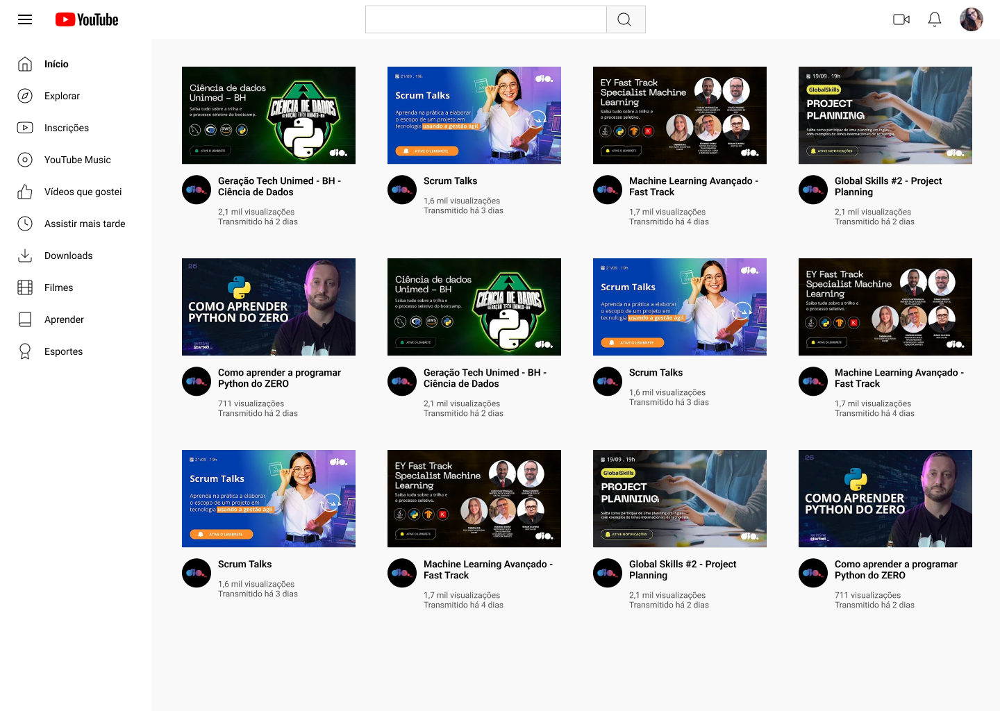

# Desafio 03: Construindo a Página de Listagem de vídeos no YouTube

Neste Desafio foi desenvolvido a Página de Listagem de vídeos do YouTube com HTML e CSS, utilizando os conhecimentos de Grid Layout aprendidos ao longo da segunda parte da formação CSS da DIO.

